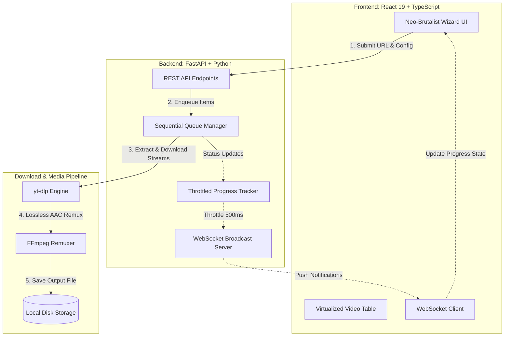

<div align="center">

# ⚡ YT RIPPER PRO // DESKTOP WEB APPLICATION
### Production-Grade YouTube Video & Playlist Downloader for Windows

[](https://fastapi.tiangolo.com)
[](https://react.dev)
[](https://www.typescriptlang.org)
[](https://vitejs.dev)
[](https://tailwindcss.com)
[](https://github.com/yt-dlp/yt-dlp)
[](https://ffmpeg.org)
[](tests/)

<br />

**A high-impact local Windows web application engineered for downloading public YouTube videos and playlists with real-time WebSocket progress, smart quality fallbacks, lossless FFmpeg stream remuxing, and a tactile Neo-Brutalist editorial UI.**

[Quick Start](#-quick-start) • [Architecture](#-architecture) • [Features](#-key-features) • [Selection Syntax](#-selection-syntax-cheat-sheet) • [API Reference](#-interactive-api-reference) • [Troubleshooting](#-troubleshooting--faq)

</div>

---

## 🖥️ Application UI Preview

```
┌────────────────────────────────────────────────────────────────────────────────────────┐
│  [YT] YT RIPPER PRO // FASTAPI + REACT 19           ● SYSTEM READY (FFmpeg 2025) [☼/☾] │
├────────────────────────────────────────────────────────────────────────────────────────┤
│                                                                                        │
│   RAW EXTRACTION ENGINE                                                                │
│   DOWNLOAD PUBLIC YOUTUBE CONTENT                                                      │
│                                                                                        │
│   ┌───────────────────────────────────────────────────────────────────────┬────────┐   │
│   │ https://www.youtube.com/playlist?list=PLrAXtmErZgOdP_8GztsuKi9nvOGQof  │ ANALYZE│   │
│   └───────────────────────────────────────────────────────────────────────┴────────┘   │
│                                                                                        │
│   [✔] PLAYLIST AUTO-PARSING     [✔] UP TO 4K / 1080P FHD     [✔] FFMPEG AAC REMUXING   │
└────────────────────────────────────────────────────────────────────────────────────────┘
```

---

## ⚡ Architecture



---

## 🚀 Key Features

- **Direct Python yt-dlp Integration**: No fragile CLI subprocess scraping; direct programmatic access to video and playlist streams, metadata extraction, and real-time progress callbacks.
- **Neo-Brutalist Editorial Aesthetic**: High-contrast black, white, and electric green (`#00FF66`), tactile chunky buttons, 3px-4px hard offset shadows (`shadow-brutal`), and responsive light/dark themes.
- **Virtualized High-Performance Playlist Table**: Uses `@tanstack/react-virtual` to smoothly render 500+ playlist entries at 60fps with zero DOM lag.
- **Windows Path & Reserved Name Sanitizer**: Automatically cleans `:`, `?`, `"`, `<`, `>`, `|`, `*` and Windows device names (`CON`, `PRN`, `AUX`, `NUL`) to guarantee zero file-creation errors.
- **Quality Fallback Guarantee**: If requested resolution (e.g. 1080p) is unavailable, automatically downloads the next highest available stream without throwing fatal errors.
- **Lossless Stream Merging & Remuxing**: Combines separate DASH video and audio streams using FFmpeg (`-c:v copy -c:a aac -strict -2`) into standard `.mp4` containers.
- **Two-Level Live Progress**:
  - **Level 1 (Current Video)**: Percent, speed in MB/s, ETA, and bytes downloaded.
  - **Level 2 (Queue Overview)**: Completed vs total count, elapsed time, and total remaining time.
- **Interactive Queue Controls**: Pause, resume, skip current video, cancel all, and retry only failed items without re-downloading existing files.
- **Crash Recovery & State Persistence**: Queue state persists to `.temp/queue_state.json` so you never lose your progress across restarts.
- **Native Windows Folder Selection**: Opens the native Windows File Explorer dialog directly from the browser UI to select any folder or drive.

---

## 🏁 Quick Start

### 1. Prerequisites
- **Python 3.11+** installed and added to `PATH`
- **Node.js 18+** & `npm`
- **FFmpeg** (automatically detected or set up via included helper)

### 2. Install Dependencies

```powershell
# In project root:
pip install -r requirements.txt

# In frontend folder:
cd frontend
npm install
npm run build
cd ..
```

### 3. Launch Application

<details open>
<summary><b>Option A: One-Click PowerShell Launchers (Recommended)</b></summary>

Open two PowerShell windows:
- **Terminal 1 (Backend)**:
  ```powershell
  .\scripts\run_backend.ps1
  ```
- **Terminal 2 (Frontend)**:
  ```powershell
  .\scripts\run_frontend.ps1
  ```
</details>

<details>
<summary><b>Option B: Manual Commands</b></summary>

- **Terminal 1 (Backend)**:
  ```powershell
  python -m uvicorn backend.main:app --host 127.0.0.1 --port 8000
  ```
- **Terminal 2 (Frontend)**:
  ```powershell
  cd frontend
  npm run dev
  ```
</details>

### 4. Open in Browser
Visit **`http://localhost:5173`** to access the web application.

---

## 📖 5-Step Guided Workflow

```
[ Step 1: Input URL ] ──> [ Step 2: Select Videos ] ──> [ Step 3: Configure ] ──> [ Step 4: Download ] ──> [ Step 5: Report ]
```

<details>
<summary><b>Step 1 — Input & URL Validation</b></summary>

Paste any public YouTube URL:
- Single videos: `https://www.youtube.com/watch?v=dQw4w9WgXcQ`
- Playlists: `https://www.youtube.com/playlist?list=PLrAXtmErZgOdP_8GztsuKi9nvOGQofMR4`
- Shorts: `https://youtube.com/shorts/dQw4w9WgXcQ`
- Livestreams & VODs: `https://www.youtube.com/live/dQw4w9WgXcQ`
- YouTube Music: `https://music.youtube.com/watch?v=...`
</details>

<details>
<summary><b>Step 2 — Playlist Selection & Virtualized Table</b></summary>

- Filter, select individual rows with checkboxes, or use the syntax box.
- View real-time estimated size badges per video based on selected resolution.
</details>

<details>
<summary><b>Step 3 — Quality & Destination Configuration</b></summary>

- **Target Resolution**: Best Available, 4K (2160p), 2K (1440p), 1080p, 720p, 480p, 360p.
- **Naming Template**:
  - `001 - Title.mp4` (Playlist index prefix)
  - `Title.mp4` (Title only)
  - `001.mp4` (Index only)
  - `Custom Template` (`%(playlist_index)03d - %(title)s.%(ext)s`)
- **Conflict Policy**: Skip Existing (recommended) or Overwrite Files.
- **Destination Folder**: Click **Browse Windows Folder** to open the native explorer dialog.
</details>

<details>
<summary><b>Step 4 — Two-Level Real-Time Download Monitoring</b></summary>

- Live MB/s speed graphs and countdown ETA.
- Interactive controls: **Pause Queue**, **Resume Queue**, **Skip / Cancel Current**, **Cancel All**.
</details>

<details>
<summary><b>Step 5 — Execution Summary & Reporting</b></summary>

- Summary matrix showing total downloaded, skipped, and failed count.
- **Copy Report** button for Markdown/Plaintext export.
- **Open Download Folder** to jump directly to Windows Explorer.
- **Retry Failed** to retry only incomplete items.
</details>

---

## ⌨️ Selection Syntax Cheat Sheet

The selection input box supports intuitive, flexible notation:

| Expression | Meaning | Example Result |
|---|---|---|
| `1, 4, 7` | Specific individual videos | Downloads items 1, 4, and 7 |
| `1-10` | Continuous index range | Downloads items 1 through 10 |
| `1-5, 10-15` | Multiple disjoint ranges | Downloads 1 to 5 and 10 to 15 |
| `1, 4, 8-12, 20` | Mixed individual items & ranges | Downloads 1, 4, 8, 9, 10, 11, 12, 20 |
| `all` | All videos in the playlist | Selects every video in playlist |

> [!TIP]
> Indexing is 1-based to match YouTube's playlist display. The parser automatically validates bounds, deduplicates indices, and reports human-readable errors for out-of-range bounds.

---

## 📡 Interactive API Reference

The backend provides complete OpenAPI Swagger documentation at **`http://127.0.0.1:8000/docs`**.

<details>
<summary><b>Core API Endpoints Breakdown</b></summary>

### System & Diagnostics
| Method | Endpoint | Description |
|---|---|---|
| `GET` | `/api/health` | System status, FFmpeg check, version, and default download directory. |

### Analysis
| Method | Endpoint | Description |
|---|---|---|
| `POST` | `/api/analyze` | Extracts video metadata, available resolutions, and estimated sizes. |

### Download & Queue Control
| Method | Endpoint | Description |
|---|---|---|
| `POST` | `/api/download/start` | Initializes sequential download queue. |
| `GET` | `/api/download/status` | Current video progress, queue state, and summary. |
| `POST` | `/api/download/pause` | Pauses active download loop. |
| `POST` | `/api/download/resume` | Resumes paused download loop. |
| `POST` | `/api/download/cancel` | Skips currently downloading video. |
| `POST` | `/api/download/cancel-all` | Cancels all remaining queue items. |
| `POST` | `/api/download/retry-failed` | Re-enqueues only failed items. |

### Windows Shell Integration
| Method | Endpoint | Description |
|---|---|---|
| `POST` | `/api/folder-select` | Opens native Windows folder browser dialog. |
| `POST` | `/api/folder-validate` | Validates manual folder path and checks free disk space. |
| `POST` | `/api/folder-open` | Opens target directory in Windows File Explorer. |

### Real-Time Streaming
| Protocol | Endpoint | Description |
|---|---|---|
| `WebSocket` | `/ws` | Throttled JSON progress streaming broadcast (500ms intervals). |

</details>

---

## 🧪 Test Suite

Run the complete test suite covering all services, parsers, and API routes:

```powershell
python -m pytest tests/ -v
```

<details>
<summary><b>Test Coverage Details (42 Tests)</b></summary>

- `test_bug_fixes.py`: Single video URLs, `/live/` extraction, short playlist IDs, Windows filename sanitization, crash recovery, contiguous indices, size mapping.
- `test_selection_parser.py`: Selection syntax, ranges, deduplication, invalid syntax.
- `test_filename_sanitizer.py`: Windows reserved device names (CON, AUX, NUL), illegal characters, unicode.
- `test_url_validator.py`: Domain validation, video ID extraction, playlist ID regex.
- `test_queue_manager.py`: Queue transitions, pause/resume, persistence to disk.
- `test_download_worker.py`: Quality fallback selectors, existing file skip policies.
- `test_api_endpoints.py`: `/api/health`, `/api/analyze`, `/api/download/start`, `/api/download/status`, `/api/folder-validate`.
</details>

---

## ❓ Troubleshooting & FAQ

<details>
<summary><b>Q: FFmpeg is not detected. How do I install it?</b></summary>

Run the included automated helper script:
```powershell
python scripts/setup_ffmpeg.py
```
Or install via `winget`:
```powershell
winget install Gyan.FFmpeg
```
</details>

<details>
<summary><b>Q: Can I download age-restricted or private videos?</b></summary>

Currently, the application processes public and unlisted YouTube videos without requiring personal credentials or Google account cookies.
</details>

<details>
<summary><b>Q: What happens if my chosen quality (e.g. 1080p) is not available?</b></summary>

The engine employs an automatic fallback strategy: it selects the highest available stream below your target resolution (e.g. 720p or 480p) and cleanly merges it with standard AAC audio.
</details>

<details>
<summary><b>Q: What happens if my computer reboots mid-download?</b></summary>

Queue state is persisted to `.temp/queue_state.json`. When you restart the application, the queue automatically loads in a safe **paused** state. Just hit **Resume** to continue.
</details>

---

<div align="center">

**YT RIPPER PRO** // BUILT FOR SPEED, STABILITY & PRECISION ON WINDOWS

</div>
